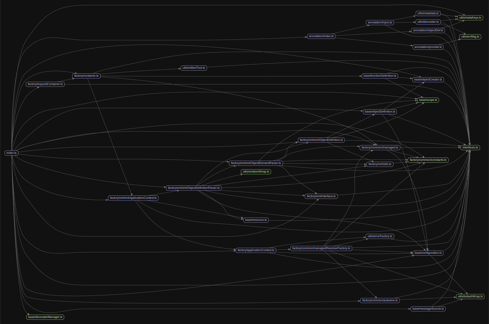

# Injection


# 源码分析

## 文件结构

``` bash
/Users/liufang/openSource/FunnyLiu/injection
├── src
|  ├── annotation
|  |  ├── index.ts
|  |  ├── inject.ts - 提供inject注解/装饰器
|  |  ├── objectDef.ts - 提供对对象元数据的一系列操作函数
|  |  └── provide.ts - 提供provide注解/装饰器
|  ├── base
|  |  ├── configuration.ts - 提供配置基类BasicConfiguration
|  |  ├── decoratorManager.ts
|  |  ├── functionDefinition.ts - 提供FunctionDefinition类
|  |  ├── messageSource.ts
|  |  ├── objectCreator.ts - 对象构建基类，具有初始化，销毁等逻辑
|  |  ├── objectDefinition.ts - 提供ObjectDefinition类
|  |  ├── resource.ts
|  |  └── scope.ts - 枚举类型
|  ├── factory
|  |  ├── applicationContext.ts - 提供BaseApplicationContext类，提供getManagedResolverFactory方法，返回ManagedResolverFactory工厂实例
|  |  ├── common
|  |  |  ├── autowire.ts
|  |  |  ├── constants.ts
|  |  |  ├── managed.ts
|  |  |  └── managedResolverFactory.ts - 解析工厂ManagedResolverFactory类
|  |  ├── container.ts - 提供Container，继承自XmlApplicationContext类
|  |  ├── requestContainer.ts - 提供RequestContainer类，继承自Container类
|  |  └── xml
|  |     ├── example.xml
|  |     ├── interface.ts
|  |     ├── utils.ts
|  |     ├── xmlApplicationContext.ts - 提供XmlApplicationContext类，继承自BaseApplicationContext类
|  |     ├── xmlObjectDefinition.ts
|  |     ├── xmlObjectDefinitionParser.ts
|  |     └── xmlObjectElementParser.ts
|  ├── index.ts
|  ├── interfaces.ts - 所有的接口定义
|  ├── jsx.ts
|  └── utils
|     ├── decorator.ts - 定义各种装饰器
|     ├── errMsg.ts - 错误消息常量
|     ├── errorFactory.ts
|     ├── lodashWrap.ts - 对依赖的lodash方法的包装
|     ├── metaKeys.ts - 一些常量key
|     ├── metadata.ts - 元数据类
|     ├── reflectTool.ts - 运用reflect的util
|     └── xmldomWrap.ts
├── tsconfig.json
└── tslint.json

directory: 33 file: 122

ignored: directory (2)

```

## 外部模块依赖

请在： http://npm.broofa.com?q=injection 查看

## 内部模块依赖


  

Injection is a powerful inversion of control container that is widely used in the midway framework and brings good user experience. 

## Installation

```bash
$ npm install injection reflect-metadata --save
```

Node.js >= 10.0.0 required.

> Injection requires TypeScript >= 2.0 and the experimentalDecorators, emitDecoratorMetadata, types and lib compilation options in your tsconfig.json file.

```json
{
  "compilerOptions": {
    "target": "ES2018",
    "module": "commonjs",
    "moduleResolution": "node",
    "experimentalDecorators": true,
    "emitDecoratorMetadata": true,
    "inlineSourceMap":true,
    "noImplicitThis": true,
    "noUnusedLocals": true,
    "stripInternal": true,
    "pretty": true,
    "declaration": true,
    "outDir": "dist",
    "lib": ["ES2018", "dom"]
  }
}
```

## Getting Started

```ts
import {Container, provide, inject} from 'injection';

@provide('userModel')
class UserModel {

}

@provide('userService')
class UserService {
  
  @inject()
  private userModel;
  
  async getUser(uid) {
    // TODO
    return 'Alex';
  }
}


const container = new Container();
container.bind(UserService);
container.bind(UserModel);

async function getData() {
  const userService = await container.getAsync<UserService>('userService'); 
  const data = await userService.getUser(123);
  return data;
}

getData().then(console.log);
// Alex
```

Document: [https://midwayjs.org/injection/guide.html](https://midwayjs.org/injection/guide.html)

## License

[MIT]((http://github.com/midwayjs/midway/blob/master/LICENSE))
