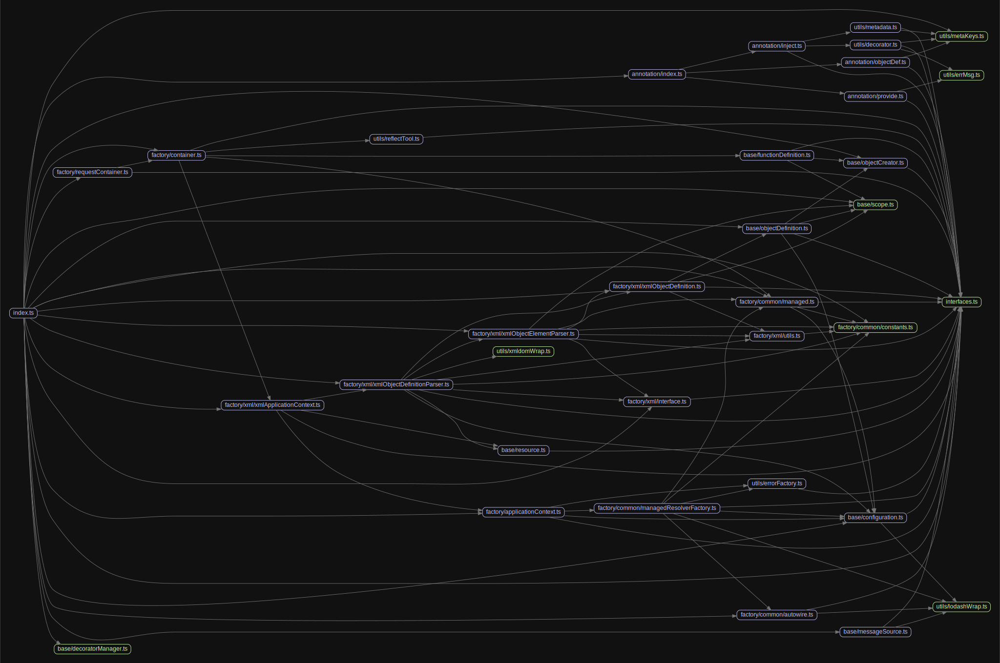

# 源码分析

## 文件结构

``` bash
/Users/liufang/openSource/FunnyLiu/injection
├── src
|  ├── annotation
|  |  ├── index.ts
|  |  ├── inject.ts
|  |  ├── objectDef.ts
|  |  └── provide.ts
|  ├── base
|  |  ├── configuration.ts
|  |  ├── decoratorManager.ts
|  |  ├── functionDefinition.ts
|  |  ├── messageSource.ts
|  |  ├── objectCreator.ts
|  |  ├── objectDefinition.ts
|  |  ├── resource.ts
|  |  └── scope.ts
|  ├── factory
|  |  ├── applicationContext.ts
|  |  ├── common
|  |  |  ├── autowire.ts
|  |  |  ├── constants.ts
|  |  |  ├── managed.ts
|  |  |  └── managedResolverFactory.ts
|  |  ├── container.ts
|  |  ├── requestContainer.ts
|  |  └── xml
|  |     ├── example.xml
|  |     ├── interface.ts
|  |     ├── utils.ts
|  |     ├── xmlApplicationContext.ts
|  |     ├── xmlObjectDefinition.ts
|  |     ├── xmlObjectDefinitionParser.ts
|  |     └── xmlObjectElementParser.ts
|  ├── index.ts
|  ├── interfaces.ts
|  ├── jsx.ts
|  └── utils
|     ├── decorator.ts
|     ├── errMsg.ts
|     ├── errorFactory.ts
|     ├── lodashWrap.ts
|     ├── metaKeys.ts
|     ├── metadata.ts
|     ├── reflectTool.ts
|     └── xmldomWrap.ts
├── tsconfig.json
└── tslint.json

directory: 33 file: 122

ignored: directory (2)

```

## 外部模块依赖

请在： http://npm.broofa.com?q=injection 查看

## 内部模块依赖


  